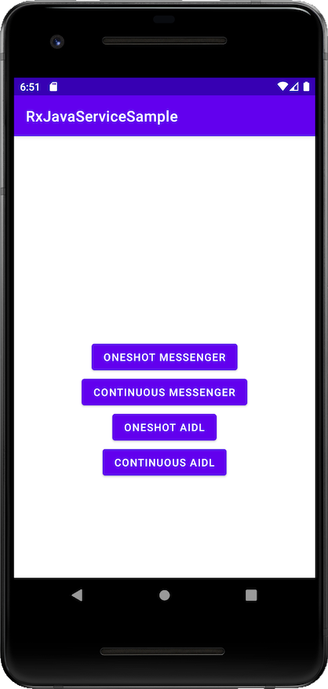

# RxJavaServiceSample

Sample Android App of RxJava that uses Messenger and AIDL under the hood.

- ONESHOT MESSENGER -> Oneshot Observable via Messenger
- CONTINUOUS MESSENGER -> Continuous Observable via Messenger
- ONESHOT AIDL -> Oneshot Observable via AIDL
- CONTINUOUS AIDL -> Continuous Observable via AIDL
